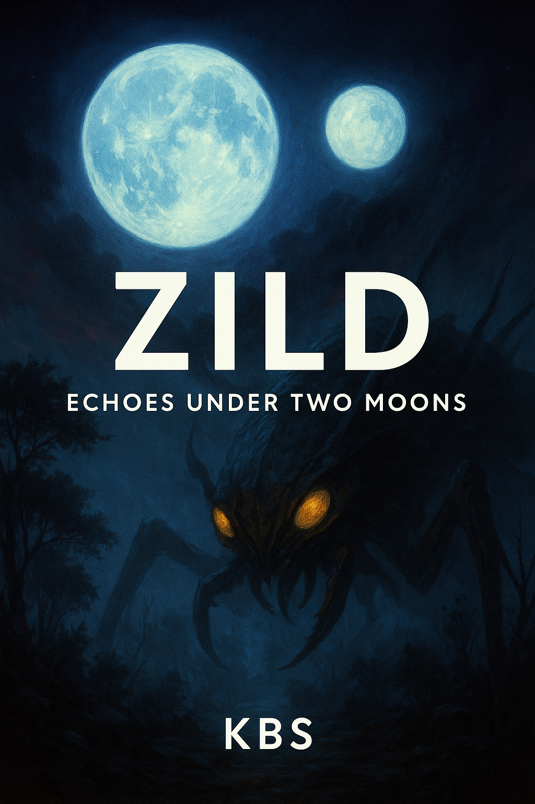
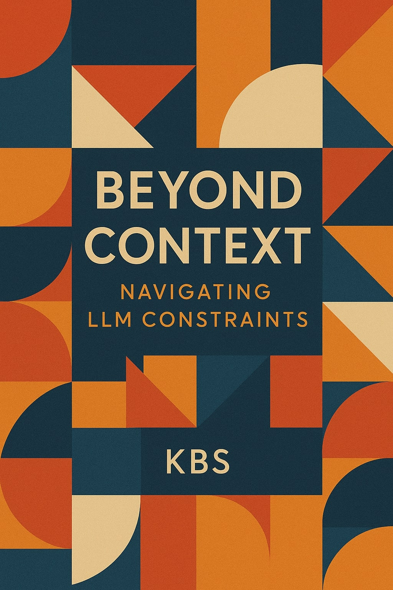
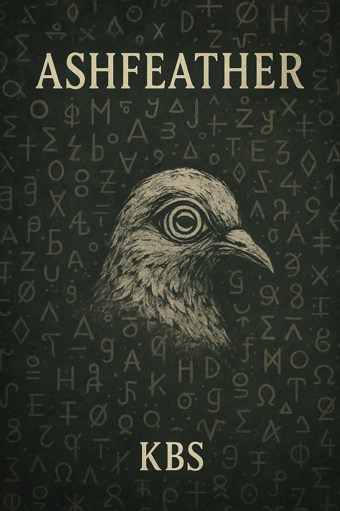

# DtRH-Books

# BOOKS

| Field | Value | Field | Value |
|-------|-------|-------|-------|
| **Title** | Zild: Echoes Under Two Moons | **Status** | Draft |
| **Cover** |  | **Page Count** | 267 |
| **Release Date** | April 26, 2025 | **Genre** | Sci-Fi, Fiction |
| **Website** | [zild.dtrh.net](https://zild.dtrh.net) | **Formats** | [Online](https://zild.dtrh.net/Book) |
| **Formats (cont.)** | [PDF (GitHub)]( # ) | **Formats (cont.)** | [PDF (DTRH)]( # ) |
| **Formats (cont.)** | [EPUB (GitHub)]( # ) | **Formats (cont.)** | [EPUB (DTRH)]( # ) |
| **Summary** | *No summary provided* | **Summary (cont.)** | - |
| **-** | - | **-** | - |
| **Title** | Beyond Context: Navigating Limitations of LLMs | **Status** | - |
| **Cover** |  | **Page Count** | 161 |
| **Release Date** | May 2025 | **Genre** | Computers, AI, Non-Fiction |
| **Website** | [beyondcontext.dtrh.net](https://beyondcontext.dtrh.net) | **Formats** | PDF, EPUB |
| **Summary** | *Beyond Context* dives into the inherent constraints of today’s large language models—finite context windows, hallucinations, prompt brittleness, and more. | **Summary (cont.)** | Drawing on hands-on experiments, practical examples, and cutting-edge research, it equips developers and AI enthusiasts with strategies to stretch LLM capabilities. |
| **Summary (cont.)** | Avoid common pitfalls and build more reliable AI systems. | **Summary (cont.)** | - |
| **-** | - | **-** | - |
| **-** | - | **-** | - |
| **Title** | Ashfeather | **Status** | - |
| **Cover** |  | **Page Count** | 25 |
| **Release Date** | May 28, 2025 | **Genre** | Fiction, Poetry |
| **Website** | [ashfeather.dtrh.net](https://ashfeather.dtrh.net) | **Formats** | Online, PDF |
| **Summary** | *Ashfeather* is a surreal, six-chapter poetic novella in which memory takes the form of a spiral-eyed bird. | **Summary (cont.)** | Through layered metaphor and dreamlike vignettes, it explores themes of loss, identity, and the power of storytelling. |
| **Summary (cont.)** | Each chapter unfolds like a journal entry—fragmented yet interwoven. | **Summary (cont.)** | Inviting readers to decode hidden meanings beneath its lyrical surface. |
| **-** | - | **-** | - |

A collection of books either written, compiled or otherwise by “KBS” of [DtRHnet – Down the Rabbit Hole](https://dtrh.net).

---

## 📚 Books

### Zild: Echoes Under Two Moons
**STATUS; Draft**

* **Page Count:** 267 pages
* **Release Date:** April 26, 2025
* **Formats:**
  - [Online](https://zild.dtrh.net/Book)
  - [PDF at Github.com]() | [PDF at DTRH.net]()
  - [EPUB at Github.com]() | [EPUB at DTRH.net]()
* **Genre:** Sci-Fi, Fiction
* **Website:** [zild.dtrh.net](https://zild.dtrh.net)
* **Summary:**

---

### Beyond Context: Navigating Limitations of LLMs

* **Page Count:** 161 pages
* **Release Date:** May 2025
* **Formats:** • PDF • EPUB
* **Genre:** Computers, AI, Non-Fiction
* **Website:** [beyondcontext.dtrh.net](https://beyondcontext.dtrh.net)
* **Summary:**
  *Beyond Context* dives into the inherent constraints of today’s large language models—finite context windows, hallucinations, prompt brittleness, and more. Drawing on hands-on experiments, practical examples, and cutting-edge research, it equips developers and AI enthusiasts with strategies to stretch LLM capabilities, avoid common pitfalls, and build more reliable AI systems.

---

### Ashfeather

* **Page Count:** 25 pages
* **Release Date:** May 28, 2025
* **Formats:** Online • PDF
* **Genre:** Fiction, Poetry
* **Website:** [ashfeather.dtrh.net](https://ashfeather.dtrh.net)
* **Summary:**
  *Ashfeather* is a surreal, six-chapter poetic novella in which memory takes the form of a spiral-eyed bird. Through layered metaphor and dreamlike vignettes, it explores themes of loss, identity, and the power of storytelling. Each chapter unfolds like a journal entry—fragmented yet interwoven—inviting readers to decode hidden meanings beneath its lyrical surface.

## 📝 License

All works © 2025 Kevin “KBS” Bradley. Licensed under \[MIT\].
